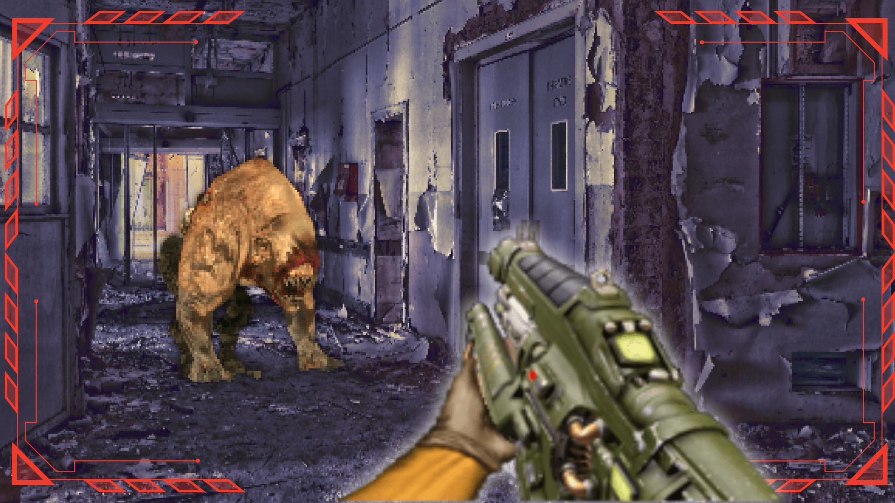

# Cub3D



## 🎮 Description

Cub3D est un projet graphique inspiré du jeu Wolfenstein 3D, recréant un moteur de raycasting permettant de naviguer dans un monde en "fausse 3D". Ce projet fait partie du cursus graphique de l'école 42.

## ⚙️ Fonctionnalités

- Rendu 3D en temps réel basé sur le raycasting
- Déplacement fluide (avancer, reculer, rotation)
- Chargement de cartes personnalisées (.cub)
- Textures différentes pour chaque orientation des murs
- Collisions avec les murs
- Possibilité de créer une image BMP du rendu

## 🔫 Fonctionnalités Bonus

- Système d'arme interactif avec animations
- Tir avec la touche `SPACE`
- Rechargement de l'arme avec la touche `R`
- Compteur de munitions en temps réel
- Stand de tir avec cibles destructibles
- Respawn des cibles avec la touche `T`
- Portes interactives ouvrables avec la touche `E`

## 🛠️ Technologies utilisées

- Langage: C
- Bibliothèque graphique: MiniLibX
- Gestion d'événements: X11

## 🚀 Installation

```bash
# Cloner le dépôt
git clone https://github.com/Freiko789/cub3d.git

# Se déplacer dans le dossier
cd cub3d

# Compiler le projet standard
make

# Compiler avec les bonus
make bonus

# Exécuter le jeu standard
./cub3D maps/map.cub

# Exécuter le stand de tir (bonus)
./cub3D_bonus bonus/shooting_range.cub
```

## 🗺️ Format des cartes

```
R 1920 1080
NO ./path_to_the_north_texture
SO ./path_to_the_south_texture
WE ./path_to_the_west_texture
EA ./path_to_the_east_texture
S ./path_to_the_sprite_texture
F 220,100,0
C 225,30,0

        1111111111111111111111111
        1000000000110000000000001
        1011000001110000002000001
        1001000000000000000000001
111111111011000001110000000000001
100000000011000001110111111111111
11110111111111011100000010001
11110111111111011101010010001
11000000110101011100000010001
10002000000000001100000010001
10000000000000001101010010001
11000001110101011111011110N0111
11110111 1110101 101111010001
11111111 1111111 111111111111
```

## 🎮 Contrôles

### Contrôles de base
- `W` `A` `S` `D` : Déplacement
- `←` `→` : Rotation de la caméra
- `ESC` : Quitter le jeu

### Contrôles bonus
- `Clic gauche` : Tirer avec l'arme
- `R` : Recharger l'arme
- `E` : Ouvrir/fermer les portes
- `T` : Réinitialiser les cibles du stand de tir

## 📝 Normes du projet

- Code conforme à la Norme 42
- Gestion propre des erreurs
- Aucune fuite mémoire
- Compilation avec flags: `-Wall -Wextra -Werror`

## 👤 Auteurs

- [dtassel](https://github.com/Freiko789)
- [phudyka](https://github.com/phudyka)

---
*Projet réalisé dans le cadre du cursus à l'école 42*
